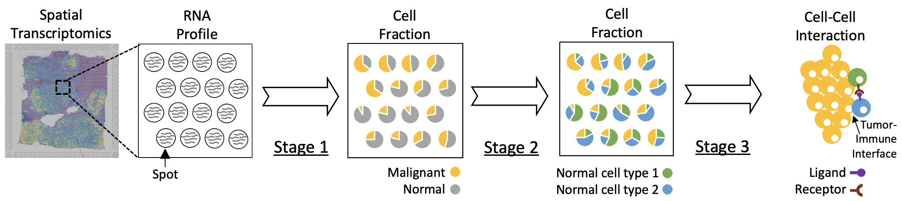

<!-- README.md is generated from README.Rmd. Please edit that file -->

# SpaCE (Spatial Cellular Estimator)

<!-- badges: start -->

<!-- badges: end -->

SpaCE is an R package for decomposing cell lineages and understanding
cell-cell interactions in tumor spatial transcriptomics data. SpaCE
first estimates cancer cell abundance through modeling the segmental
copy number variations. SpaCE then uses a constrained regression model
to calibrate local tissue densities and determine stromal and immune
cell lineage hierarchies. Further, SpaCE can reveal how intercellular
signaling interactions to promote cancer progression.



## Installation

To install `SpaCE`, we recommend using `devtools`:

``` r
# install.packages("devtools")
devtools::install_github("data2intelligence/SpaCE")
```

## Tutorials

Click [here](./docs/tutorial.md) to visit the `SpaCE` tutorial.
