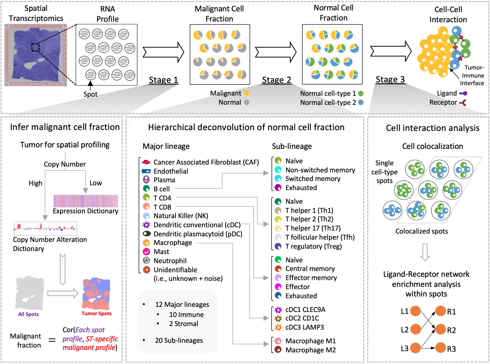

<!-- README.md is generated from README.Rmd. Please edit that file -->

# SpaCET (Spatial Cellular Estimator for Tumors)

<!--

-->

SpaCET is an R package for analyzing cancer spatial transcriptomics (ST)
datasets to estimate cell lineage and intercellular interactions in
tumor microenvironment. Briefly, SpaCET first estimates cancer cell
abundance by integrating a gene pattern dictionary of common
malignancies. SpaCET then uses a constrained regression model to
calibrate local tissue densities and determine stromal and immune cell
lineage fraction. Further, SpaCET can reveal putative cell-cell
interactions in tumor microenvironment. Additionally, although SpaCET
does not require any input cell reference profile to process tumor ST
data, SpaCET can still accept a matched scRNA-seq dataset as customized
references to carry out cell type deconvolution.


## Installation

To install `SpaCET`, we recommend using `devtools`:

``` r
# install.packages("devtools")
devtools::install_github("data2intelligence/SpaCET")
```

Or user can install `SpaCET` from the local source code. Click
\[<a href="https://api.github.com/repos/data2intelligence/SpaCET/tarball/HEAD" target="_blank">here</a>\]
to download it.

``` r
# install SpaCET in R environment.
install.packages("Location_to_the_source_code_file", repos = NULL, type="source")
```

## Dependencies

-   R version \>= 4.2.0.
-   R packages: Matrix, jsonlite, ggplot2, reshape2, patchwork, png,
    jpeg, shiny, MUDAN, factoextra, NbClust, cluster, parallel, psych,
    BiRewire, limma.

## Example

``` r
library(SpaCET)

visiumPath <- file.path(system.file(package = "SpaCET"), "extdata/Visium_BC")
SpaCET_obj <- create.SpaCET.object.10X(visiumPath = visiumPath)
SpaCET_obj <- SpaCET.deconvolution(SpaCET_obj, cancerType="BRCA", coreNo=8)

SpaCET_obj@results$deconvolution$propMat[1:13,1:5]

##                   50x102 59x19        14x94        47x13        73x43
## Malignant   2.860636e-01     1 6.845966e-02 3.899756e-01 9.608802e-01
## CAF         3.118545e-01     0 3.397067e-01 1.111980e-01 3.372692e-02
## Endothelial 5.510895e-02     0 1.427060e-01 3.080531e-02 5.263544e-03
## Plasma      2.213392e-02     0 1.507382e-02 1.183170e-02 9.071809e-06
## B cell      3.885793e-03     0 9.271616e-02 1.406470e-01 1.329085e-06
## T CD4       1.344389e-01     0 1.554305e-02 1.249414e-01 1.112392e-05
## T CD8       7.578696e-03     0 2.514558e-07 1.379856e-03 1.123043e-06
## NK          7.104005e-04     0 1.670019e-06 4.890387e-08 3.562557e-07
## cDC         1.421632e-07     0 8.278023e-02 7.584295e-02 2.851146e-07
## pDC         1.606443e-06     0 2.283754e-02 1.805671e-02 3.878344e-07
## Macrophage  1.703304e-01     0 5.021248e-02 9.531511e-02 9.253645e-07
## Mast        7.905067e-08     0 1.621498e-05 1.333430e-07 1.162099e-07
## Neutrophil  1.380073e-05     0 9.528996e-07 1.167503e-08 9.908635e-05
```

## Tutorial

-   [Cell type deconvolution and interaction
    analysis](https://data2intelligence.github.io/SpaCET/articles/visium_BC.html)  
-   [Deconvolution with a matched scRNA-seq data
    set](https://data2intelligence.github.io/SpaCET/articles/oldST_PDAC.html)

## Citation

Beibei Ru, Jinlin Huang, Yu Zhang, Kenneth Aldape, Peng Jiang.
Estimation of cell lineages in tumors from spatial transcriptomics data.
Nature Communications 14, 568 (2023).
\[<a href="https://www.nature.com/articles/s41467-023-36062-6" target="_blank">Link</a>\]
