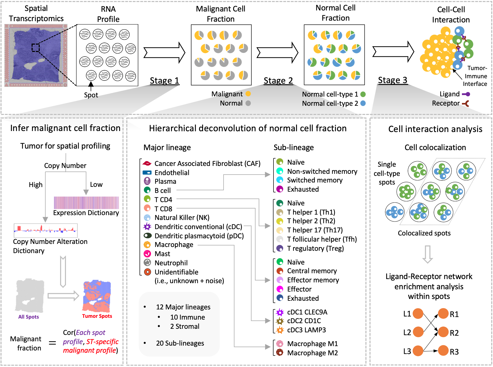

<!-- README.md is generated from README.Rmd. Please edit that file -->

# SpaCET: Spatial Cellular Estimator for Tumors 

<!-- badges: start -->

<!-- badges: end -->

SpaCET is an R package designed for analyzing cancer spatial
transcriptomics (ST) datasets to estimate cell lineages and
intercellular interactions within the tumor microenvironment. In a
nutshell, SpaCET first infers <b>cancer cell</b> abundance by
integrating a gene pattern dictionary of common malignancies.
Subsequently, SpaCET employs a constrained linear regression model to
calibrate local tissue densities and determine <b>stromal and immune</b>
cell lineage fractions based on a comprehensive non-malignant cell
atlas. Furthermore, SpaCET has the capability to unveil putative
<b>cell-cell interactions</b> within the tumor microenvironment,
particularly at the tumor-immune interface. Of note, although SpaCET
does not require any input cell references for the analysis of tumor ST
data, SpaCET can still incorporate a matched scRNA-seq dataset as
customized references to conduct cell type deconvolution of any ST
dataset. Please see the tutorials below for step-by-step guidance.



## Installation

To install `SpaCET`, we recommend using `devtools`:

``` r
# install.packages("devtools")
devtools::install_github("data2intelligence/SpaCET")
```

Or user can install `SpaCET` from the source code. Click
<a href="https://api.github.com/repos/data2intelligence/SpaCET/tarball/HEAD" target="_blank">here</a>
to download it.

``` r
# install.packages("remotes")
remotes::install_deps("Path_to_the_source_code", force = TRUE)

# install SpaCET in the R environment.
install.packages("Path_to_the_source_code", repos = NULL, type="source")
```

## Dependencies

- R version \>= 4.2.0.
- R packages: Matrix, jsonlite, ggplot2, reshape2, scatterpie,
  patchwork, png, shiny, plotly, DT, MUDAN, factoextra, NbClust,
  cluster, parallel, pbmcapply, psych, BiRewire, limma, arrow, UCell,
  RANN, sctransform.

## Example

``` r
library(SpaCET)

visiumPath <- file.path(system.file(package = "SpaCET"), "extdata/Visium_BC")
SpaCET_obj <- create.SpaCET.object.10X(visiumPath = visiumPath)
SpaCET_obj <- SpaCET.deconvolution(SpaCET_obj, cancerType="BRCA", coreNo=6)

SpaCET_obj@results$deconvolution$propMat[1:13,1:5]
```

## Tutorial

SpaCET is applicable for deconvolving spatial transcriptomics data
across different platforms and resolutions. In addition, it can compute
gene set scores and assess spatial correlations.

#### Core

- [Cell type deconvolution and interaction
  analysis](https://data2intelligence.github.io/SpaCET/articles/visium_BC.html)  
- [Deconvolution with a matched scRNA-seq data
  set](https://data2intelligence.github.io/SpaCET/articles/oldST_PDAC.html)
- [Application to high resolution spatial transcriptomics
  data](https://data2intelligence.github.io/SpaCET/articles/hiresST_CRC.html)

#### Misc

- [Gene set score calculation for spatial
  spots](https://data2intelligence.github.io/SpaCET/articles/GeneSetScore.html)
- [Spatially variable genes and co-expressed ligand–receptor
  interactions](https://data2intelligence.github.io/SpaCET/articles/SpatialCorrelation.html)

## Data availability

This <a href="https://doi.org/10.5281/zenodo.14976008"
target="_blank">Link</a> provides access to the 10 scRNA-seq datasets
used to generate SpaCET’s in-house cell-type reference, along with the 8
spatial transcriptomics samples demonstrated in our manuscript.

## Contact

For questions, bug reports, or feature requests, please submit an
[issue](https://github.com/data2intelligence/SpaCET/issues). To keep the
issue tracker focused and constructive, advertising or promotional
content is not permitted.

## Citation

Beibei Ru, Jinlin Huang, Yu Zhang, Kenneth Aldape, Peng Jiang.
Estimation of cell lineages in tumors from spatial transcriptomics data.
**Nature Communications** 14, 568 (2023).
\[<a href="https://www.nature.com/articles/s41467-023-36062-6"
target="_blank">Full Text</a>\]
