# Tutorial for SpaCE (Spatial Cellular Estimator)

Here, we will show how to use SpaCE to deconvolve tumor spatial transcriptomics (ST) data, visualize the deconvolution results, and explore the cell-cell interaction during cancer progression.

## Load libraries

In order to run SpaCE, first you need to load SpaCE and other libraries required into your R session. 

``` r
suppressPackageStartupMessages({
  library(SpaCE)
  library(Matrix)
  library(jsonlite)
  library(png)
  library(ggplot2)
  library(reshape2)
  library(cowplot)
  library(GSVA)
  library(infercnv)
  library(ComplexHeatmap)
  library(psych)
  library(ppcor)
  library(ggraph)
  library(tidygraph)
  library(parallel)
})

```

## Create SpaCE object

To read your ST data into R, user can create an SpaCE object by `create.SpaCE`. Basically, `create.SpaCE` requires two parameters `seqPath` and `imagePath`, which point the standard output folders of 10x Visium dataset. 

The `seqPath` folder should include\
"barcodes.tsv.gz": spot level barcodes\
"features.tsv.gz": list of genes\
"matrix.mtx.gz": (sparse) matrix of counts

The `imagePath` folder should include\
“tissue_positions_list.csv” : barcodes and spatial information\
“tissue_lowres_image.png” : hematoxylin and eosin (H&E) image\
“scalefactors_json.json” : scaling factors for adjusting the coordinates 

Here, we use a breast cancer ST dataset from 10x Visium website as an example.

``` r
library(SpaCE)

# load the in-house breast cancer ST data. User also can set these two pathes to their own data.
seqPath <- system.file("extdata",'seq',package = 'SpaCE')
imagePath <- system.file("extdata",'image',package = 'SpaCE')

# load ST data to create an SpaCE object.
ST <- create.SpaCE(seqPath, imagePath)

```

The count matrix is stored in `ST@input$counts`. 

``` r
#show the ST counts (gene × spot)
ST@input$counts[1:8,1:3]
#             394.480194075x431.3861343 446.88118365x150.7920777 182.747522925x404.727718725
# MIR1302-2HG                         0                        0                           0
# FAM138A                             0                        0                           0
# OR4F5                               0                        0                           0
# AL627309.1                          0                        0                           0
# AL627309.3                          0                        0                           0
# AL627309.2                          0                        0                           0
# AL627309.4                          0                        0                           0
# AL732372.1                          0                        0                           0

```

## Show key quality control (QC) metrics

Once you have created an SpaCE object, you can use `ST.metrics`  to compute and plot both UMI and gene counts across ST spots, respectively. Of note, the metrics matrix is stored in `ST@results$metrics`.

``` r
# compute the QC metrics.
ST <- ST.metrics(ST)

# plot the QC metrics.
ST.metrics.plot(ST, cols = c("lightblue", "blue", "darkblue"))

```

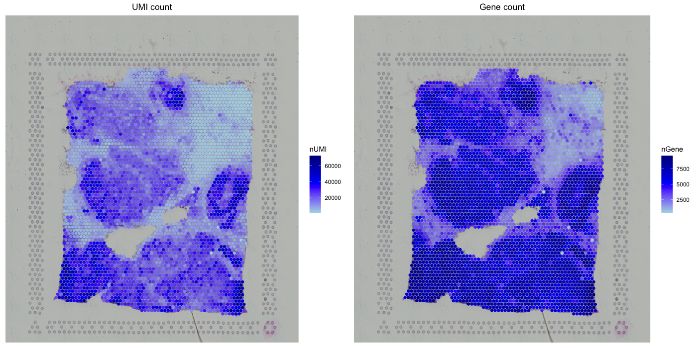

## Deconvolve ST data

By two steps, `ST.deconvolve` would deconvolve all mixtures of ST spots into malignant, immune, and stromal cells as well as an unidentifiable component. We first estimate malignant cell faction by modeling the segmental copy number variations (CNVs) from the expression profiles of ST data. Of note, this strategy avoids the workload of building malignant references case by case. Subsequently, based on an in-house hierarchical cell lineage derived from single-cell RNA-seq data sets from diverse cancer types, we use a constrained regression model to determine stromal and immune cell fraction, and also include an unidentifiable component to calibrate cellular density variations across tissue regions.

The inferred cell-type fraction and CNV value of all ST spots are stored in `ST@input$Fraction` and `ST@input$CNV`. Of note, the latter one will be used to explore the malignant cell clone structure in the following section. 

``` r
# set the path to temporary file generated during deconvolution
tempFilePath <- "/Users/rub2/Downloads/"

# deconvolve ST data
ST <- deconvolve.ST(ST, tempFilePath)

# show the ST deconvolution results (cell type × spot)
ST@results$fraction[,1:3]
#                  394.480194075x431.3861343 446.88118365x150.7920777 182.747522925x404.727718725
# Malignant                     1.145085e-01             6.374932e-01                9.242377e-02
# B cell                        1.266962e-06             2.729358e-02                2.442029e-03
# CAF                           2.810727e-01             5.567629e-02                2.113566e-01
# Dendritic                     1.229707e-06             2.418508e-08                3.097959e-05
# Endothelial                   8.303732e-04             8.125009e-02                7.286822e-02
# Macrophage                    2.749378e-01             7.318245e-02                1.130819e-01
# Mast                          3.261972e-05             1.866764e-03                6.943601e-05
# Neutrophil                    2.149391e-06             1.081567e-07                9.328643e-09
# NK                            5.838546e-07             3.093022e-05                2.180547e-07
# T CD4                         4.777462e-06             6.065937e-03                4.760630e-02
# T CD8                         8.035477e-03             4.022806e-05                4.899418e-07
# Unidentifiable                3.205725e-01             1.171004e-01                4.601200e-01
# M1                            1.357387e-01             4.780340e-02                6.475622e-02
# M2                            1.391991e-01             2.537905e-02                2.276754e-02
# Macrophage other              5.755968e-11             2.587107e-09                2.555817e-02
# T CD4 naive                   0.000000e+00             2.018646e-03                8.440469e-03
# T helper                      0.000000e+00             2.018646e-03                4.323932e-08
# Treg                          0.000000e+00             2.018646e-03                3.711067e-07
# T CD4 other                   1.000000e-05             1.000000e-05                3.916542e-02

```

Notes:  CAF: cancer-associated fibroblast; NK: natural killer cell; Treg: T regulatory cell. Cell type “Macrophage other” are macrophages that do not significantly express marker genes of both macrophage M1 and M2. Cell type “T CD4 other” are T CD4 cells that do not significantly express marker genes of T CD4 naive, T helper, and Treg cells. 

## Visualize the ST deconvolution results

We provide two functions `ST.deconv.res.violin` and `ST.deconv.res.scatter` to visualize the ST deconvolution results. Users can summarize the cell fraction of each cell type across all ST spots by `ST.deconv.res.violin` and hence learn the cell composition of cancer tissue for ST profiling. For example, the current breast cancer tissue was shown to mainly consist of malignant, macrophage, CAF, endothelial, and B cells. Moreover, `ST.deconv.res.scatter` can be used to show the spatial distribution of cell fraction for the cell type of interest by setting the parameter `cellTypes`.

``` r
# summarize the deconvolution results in violin plot
ST.deconv.res.violin(ST)

```

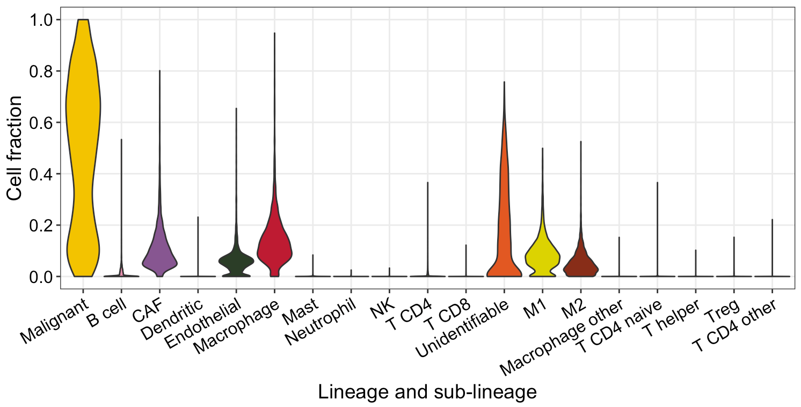

``` r
# visualize the spatial distribution of cell types
ST.deconv.res.scatter(ST, cellTypes=c("Malignant","B cell","CAF") )
ST.deconv.res.scatter(ST, cellTypes=c("Macrophage","M1","M2") )

```

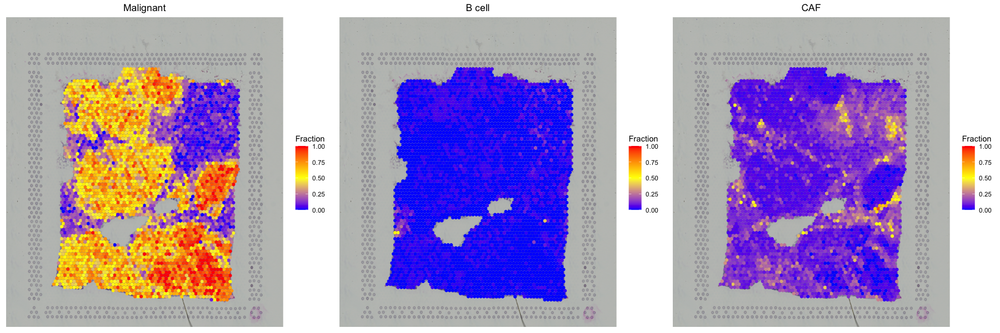
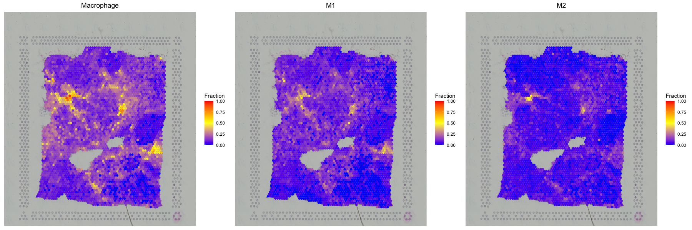


## Identify the clone structure of malignant cells

To assess the spatial organization of cancer clones, we focus on the ST spots with high fractions (>0.5) of malignant cells based on the deconvolution results. Users can run `ST.malignant.clone.heatmap` to cluster the inferred CNV values of malignant cell spots to determine the clone structure. Of note, `cutoffMalignant` is used to set the cutoff of high malignant cell fractions, and `nClone` is the clone (cluster) number of hierarchical clustering. The estimated clone identities are stored in `ST@results$clone`.

``` r
# cluster the cnv values to identify malignant cell clone
ST <- ST.malignant.clone.heatmap(ST, cutoffMalignant=0.5, nClone=3)

```

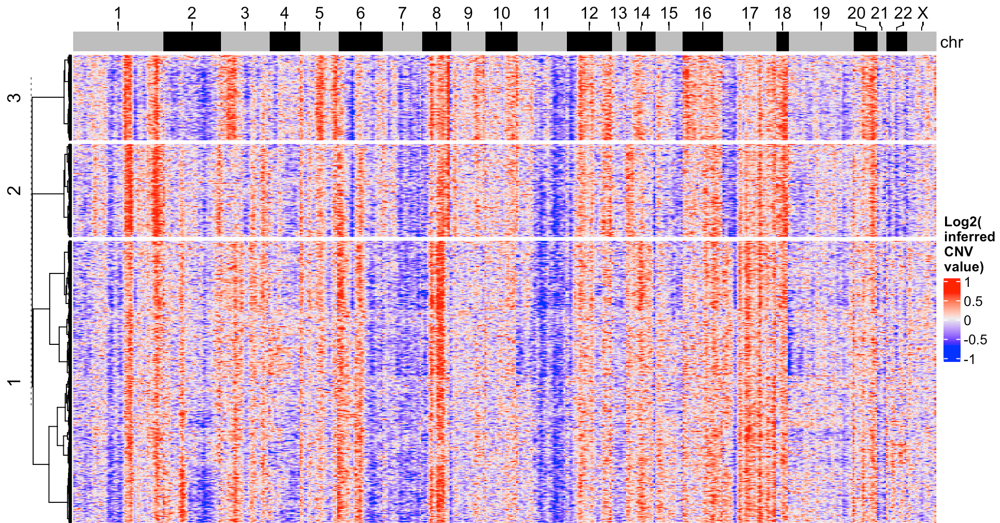

``` r
# show the clone (cluster) identity for malignant cell spots
ST@results$clone[1:16]
#   446.88118365x150.7920777  529.35643035x231.757423425   459.133658775x414.3564315 482.549500125x367.004946825 
#                        "3"                         "3"                         "2"                         "2" 
#135.519800625x303.440591025    306.1386108x353.81187765 482.599005075x394.034649525    488.36633175x323.0693037 
#                        "1"                         "1"                         "2"                         "2" 
#    476.237619x127.07920665    517.97029185x441.2871243 158.935641975x249.331680675  488.06930205x160.866335025 
#                        "3"                         "2"                         "1"                         "3" 
#  347.400986625x411.1881147  282.82177935x475.519797225     312.1782147x445.0495005    411.9801939x353.61385785 
#                        "1"                         "1"                         "1"                         "1" 
```

Moreover, you can obtain the spatial distribution of distinct malignant cell clones by running `ST.malignant.clone.scatter`.

``` r                      
# plot the spatial distribution of malignant cell clones
ST.malignant.clone.scatter(ST)

```

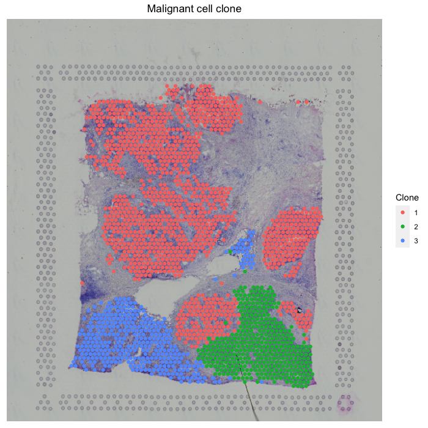


## Explore the intercellular interaction 

After decomposing cell fractions from tumor ST data, SpaCE can infer cell-cell interactions (CCIs) in tumor microenvironment based on cell co-localization and ligand-receptor co-expression analyses. We first calculate the correlation between cell fractions across ST spots to evaluate co-localization of cell-type pairs. Furthermore, for the co-localized cell-type pairs, we test the enrichment of up-regulated ligand and receptor gene pairs as evidence of physical interactions.

First, `ST.CCI.colocalization` can analyze the co-localization of cell-type pairs by calculating their Spearman correlation, and the corresponding results are stored in `ST@results$colocalization`. Of note, partial correlations, corrected for malignant cell fractions, were computed between non-malignant cell types.

``` r
# calculate the cell-cell co-localization
ST <- ST.CCI.colocalization(ST)

# visualize the cell-cell co-localization
ST.CCI.colocalization.plot(ST)

```
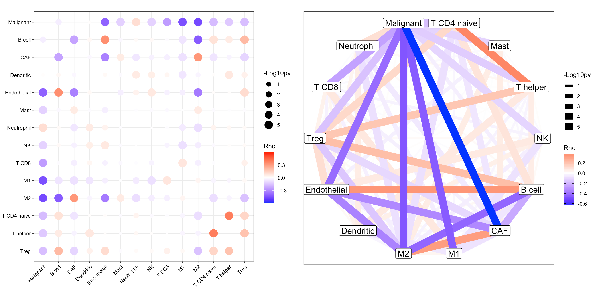

Then, we further identified cell communication evidence by ligand-receptor (L-R) interactions. We computed an L-R interactions network score for each spot as the sum of expression products between L-R pairs, normalized by the average L-R network score from 1,000 random networks with the same degrees. The p-value was calculated as the fraction of random network scores that exceeded the original score. 

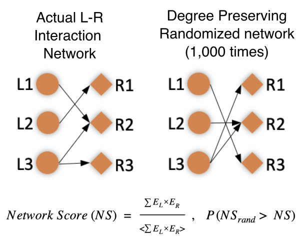

We implemented the aforementioned process by designing `ST.CCI.LRInteraction` function that can calculate and visualize the L-R interaction. The corresponding results are stored in `ST@results$LRInteraction`.

``` r
# calculate the L-R interaction
ST <- ST.CCI.LRInteraction(ST)

# visualize the L-R interaction
ST.CCI.LRInteraction.plot(ST)

```
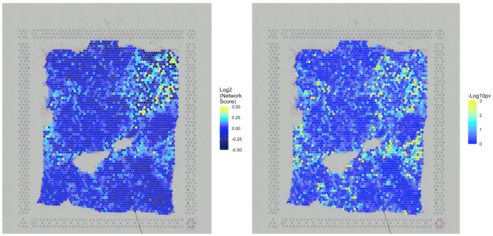

``` r
# show the L-R network score and p value for the first eight ST spots.
ST@results$LRInteraction[,1:8]

#               394.480194075x431.3861343 446.88118365x150.7920777 182.747522925x404.727718725
# Network Score                1.10719731                0.9611687                   1.1017179
# P value                      0.02297702                0.8091908                   0.2047952
#               376.28712495x130.64356305 529.35643035x231.757423425 459.133658775x414.3564315
# Network Score               1.123445913                 1.06916201                 0.9062269
# P value                     0.007992008                 0.02897103                 0.9630370

```

## Analyze the cell-type pair of interest
`ST.CCI.cellTypePair.scatter` and `ST.CCI.cellTypePair.boxplot` can further analyze the intercellular interaction of a particular cell-type pair by setting the parameter `cellTypePair`. 

Here, we take the cell-type pair of CAF and M2 as an example. For the co-localization between CAF and M2 cells in the breast tumor, SpaCE grouped ST spots into four categories, including CAF-M2 co-localization, CAF dominated, M2 dominated, and the rest.

``` r
# display the spatial distribution of CAF-M2 co-localization
ST.CCI.cellTypePair.scatter(ST, cellTypePair=c("CAF","M2"))

```
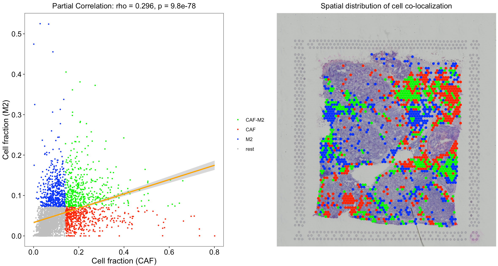

We found that CAF-M2 colocalization spots have more substantial L-R network scores and p-values than CAF or M2-dominated spots. This result corroborates the correlation between two cell type fractions.

``` r
# test the L-R interactions for CAF-M2 co-localization
ST.CCI.cellTypePair.box(ST, cellTypePair=c("CAF","M2"))

```
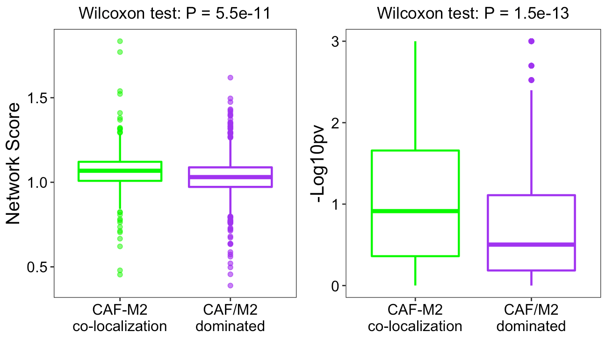


## Enrich cell-cell interactions at the tumor-immune interface
`ST.CCI.tumorBorder.distance` can be used to calculate the distance of cell-cell interactions to tumor-immune interface. We still use the same example as before. Interestingly, besides the interaction significance, we found an enrichment of CAF-M2 interactions close to boundaries between tumor and immune/stromal regions. The distance between CAF-M2 and the tumor-immune border was calculated by averaging the distances between each CAF-M2 interaction spot and its nearest tumor border spot. We randomly selected the same number of spots as CAF-M2 spots from the non-malignant regions and calculated their distances to the border as the null distribution. The result showed that CAF-M2 interaction spots are significantly closer to the tumor-immune boundaries.

``` r
# compute the distance of CAF-M2 to tumor border
ST.CCI.tumorBorder.distance(ST, cellTypePair=c("CAF","M2"))

```
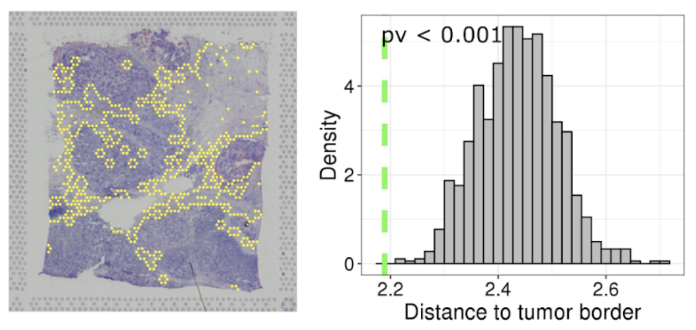


## Save the current SpaCE object to a rda file

User can save the SpaCE object in order to check the analysis results in future.

``` r
save(ST, file="/Users/rub2/Downloads/ST.rda")

```

## Session Info

``` r
sessionInfo()

```

``` r
## R version 4.0.3 (2020-10-10)
## Platform: x86_64-apple-darwin17.0 (64-bit)
## Running under: macOS Mojave 10.14.6
## 
## Matrix products: default
## BLAS:   /System/Library/Frameworks/Accelerate.framework/Versions/A/Frameworks/vecLib.framework/Versions/A/libBLAS.dylib
## LAPACK: /Library/Frameworks/R.framework/Versions/4.0/Resources/lib/libRlapack.dylib
## 
## locale:
## [1] en_US.UTF-8/en_US.UTF-8/en_US.UTF-8/C/en_US.UTF-8/en_US.UTF-8
## 
## attached base packages:
## [1] parallel  grid      stats     graphics  grDevices utils     datasets  methods   base     
## 
## other attached packages:
##  [1] ppcor_1.1                  MASS_7.3-53                psych_2.1.3               
##  [4] ComplexHeatmap_2.7.10.9002 Polychrome_1.2.6           infercnv_1.6.0            
##  [7] GSVA_1.38.0                cowplot_1.1.1              png_0.1-7                 
## [10] jsonlite_1.7.2             Matrix_1.2-18              tidygraph_1.2.0           
## [13] ggraph_2.0.5               ggplot2_3.3.2              SpaCE_0.0.0.9000          
## 
## loaded via a namespace (and not attached):
##   [1] circlize_0.4.12             plyr_1.8.6                  igraph_1.2.6               
##   [4] GSEABase_1.52.1             splines_4.0.3               BiocParallel_1.24.1        
##   [7] listenv_0.8.0               GenomeInfoDb_1.26.2         TH.data_1.0-10             
##  [10] digest_0.6.27               foreach_1.5.1               htmltools_0.5.0            
##  [13] rsconnect_0.8.16            viridis_0.5.1               magrittr_2.0.1             
##  [16] memoise_1.1.0               cluster_2.1.0               doParallel_1.0.16          
##  [19] limma_3.46.0                globals_0.14.0              fastcluster_1.1.25         
##  [22] annotate_1.68.0             graphlayouts_0.7.1          matrixStats_0.57.0         
##  [25] sandwich_3.0-0              colorspace_2.0-0            blob_1.2.1                 
##  [28] ggrepel_0.9.1               xfun_0.20                   dplyr_1.0.2                
##  [31] crayon_1.3.4                RCurl_1.98-1.2              libcoin_1.0-6              
##  [34] graph_1.68.0                survival_3.2-7              zoo_1.8-8                  
##  [37] iterators_1.0.13            ape_5.4-1                   glue_1.4.2                 
##  [40] polyclip_1.10-0             gtable_0.3.0                zlibbioc_1.36.0            
##  [43] XVector_0.30.0              GetoptLong_1.0.5            DelayedArray_0.16.0        
##  [46] shape_1.4.5                 SingleCellExperiment_1.12.0 BiocGenerics_0.36.0        
##  [49] scales_1.1.1                futile.options_1.0.1        mvtnorm_1.1-1              
##  [52] DBI_1.1.0                   edgeR_3.32.0                Rcpp_1.0.5                 
##  [55] viridisLite_0.3.0           xtable_1.8-4                clue_0.3-59                
##  [58] tmvnsim_1.0-2               bit_4.0.4                   stats4_4.0.3               
##  [61] tsne_0.1-3                  httr_1.4.2                  gplots_3.1.1               
##  [64] RColorBrewer_1.1-2          modeltools_0.2-23           ellipsis_0.3.1             
##  [67] pkgconfig_2.0.3             reshape_0.8.8               XML_3.99-0.5               
##  [70] farver_2.0.3                locfit_1.5-9.4              tidyselect_1.1.0           
##  [73] labeling_0.4.2              rlang_0.4.9                 reshape2_1.4.4             
##  [76] AnnotationDbi_1.52.0        munsell_0.5.0               tools_4.0.3                
##  [79] generics_0.1.0              RSQLite_2.2.1               evaluate_0.14              
##  [82] stringr_1.4.0               argparse_2.0.3              knitr_1.30                 
##  [85] bit64_4.0.5                 fitdistrplus_1.1-3          caTools_1.18.0             
##  [88] purrr_0.3.4                 packrat_0.5.0               coin_1.3-1                 
##  [91] future_1.21.0               nlme_3.1-149                slam_0.1-48                
##  [94] formatR_1.7                 compiler_4.0.3              rstudioapi_0.13            
##  [97] tibble_3.0.4                tweenr_1.0.1                stringi_1.5.3              
## [100] futile.logger_1.4.3         lattice_0.20-41             vctrs_0.3.5                
## [103] pillar_1.4.7                lifecycle_0.2.0             GlobalOptions_0.1.2        
## [106] bitops_1.0-6                GenomicRanges_1.42.0        R6_2.5.0                   
## [109] KernSmooth_2.23-17          gridExtra_2.3               IRanges_2.24.1             
## [112] parallelly_1.22.0           rjags_4-10                  codetools_0.2-16           
## [115] lambda.r_1.2.4              gtools_3.8.2                SummarizedExperiment_1.20.0
## [118] rjson_0.2.20                withr_2.3.0                 mnormt_2.0.2               
## [121] multcomp_1.4-15             S4Vectors_0.28.1            GenomeInfoDbData_1.2.4     
## [124] tidyr_1.1.2                 coda_0.19-4                 rmarkdown_2.7              
## [127] MatrixGenerics_1.2.0        Cairo_1.5-12.2              BiRewire_3.22.0            
## [130] ggforce_0.3.2               scatterplot3d_0.3-41        Biobase_2.50.0   
```
