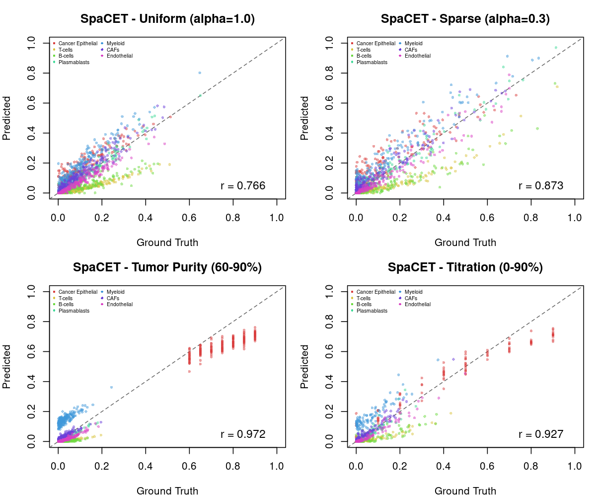
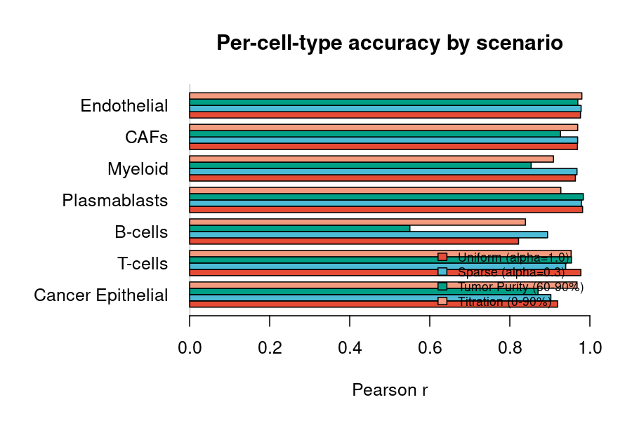
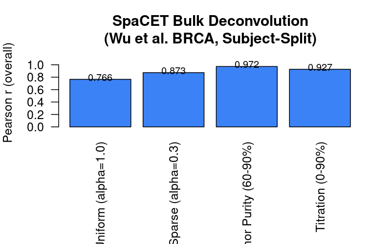

```{r, include = FALSE}
knitr::opts_chunk$set(
  collapse = TRUE,
  comment = "#>"
)
```

This tutorial benchmarks `SpaCET.deconvolution.matched.scRNAseq()` on bulk
RNA-seq using pseudobulk mixtures from Wu et al. 2021 (*Nature Genetics*,
GSE176078) BRCA scRNA-seq.

**Fair evaluation:** The dataset is split 50/50 by patient. The TRAIN set
provides the deconvolution reference; pseudobulk is generated exclusively
from the TEST set, ensuring no cell overlap.

**Four scenarios:**

| Scenario | Description |
|----------|-------------|
| Uniform  | Dirichlet alpha=1.0 (balanced mixing) |
| Sparse   | Dirichlet alpha=0.3 (dominant cell types) |
| Tumor Purity | 60–90% malignant cells |
| Titration | 0–90% malignant cells |


## Deconvolution

Create a SpaCET object from bulk counts and run deconvolution with a matched
scRNA-seq reference (TRAIN set):

```r
library(SpaCET)

# Wrap bulk RNA-seq counts (genes x samples) in a SpaCET object
coords <- data.frame(X = seq_len(ncol(bulk_counts)), Y = rep(1, ncol(bulk_counts)))
rownames(coords) <- colnames(bulk_counts)
obj <- create.SpaCET.object(counts = bulk_counts, spotCoordinates = coords, platform = "OldST")

# Deconvolve using matched scRNA-seq reference
obj <- SpaCET.deconvolution.matched.scRNAseq(
  obj,
  sc_includeMalignant = TRUE,
  cancerType          = "BRCA",
  sc_counts           = sc_counts_train,
  sc_annotation       = sc_annotation,
  sc_lineageTree      = sc_lineageTree
)

# Cell type proportions (types x samples)
obj@results$deconvolution$propMat[1:5, 1:5]
```


## Results

### Predicted vs Ground Truth



SpaCET accurately recovers cell type proportions across all four scenarios.
Tumor-containing scenarios (purity, titration) benefit from SpaCET's
malignant cell inference.

### Per-Cell-Type Accuracy



### Overall Performance




## Reproducing This Benchmark

The full benchmark script (data loading, pseudobulk generation, evaluation)
is available at `scripts/generate_bulk_figures.R` in the package repository.
