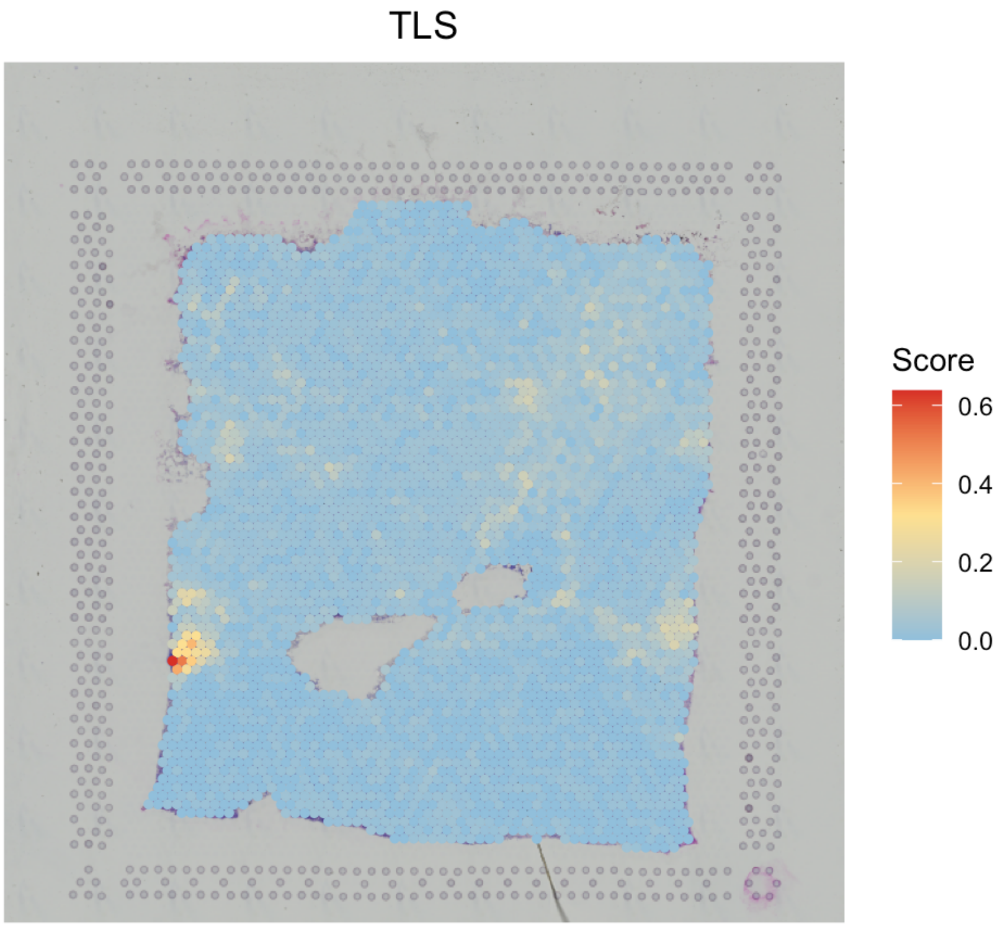

---
output: github_document
---


```{r, include = FALSE}
knitr::opts_chunk$set(
  collapse = TRUE,
  comment = "#>"
)
```

In this vignette, we will demonstrate how to use `SpaCET` to calculate and visualize spots' gene set score for the in-house or user-defined gene sets. The in-house gene sets include hallmarks, cancer cell states, and tertiary lymphoid structures (TLS).

## Create SpaCET object

To read your ST data into R, user can create an SpaCET object by using `create.SpaCET.object` or `create.SpaCET.object.10X`. Specifically, if users are analyzing an ST dataset from 10x Visium, they only need to input "visiumPath" by using `create.SpaCET.object.10X`. Please make sure that "visiumPath" points to the standard output folders of 10x Space Ranger, which has both "filtered_feature_bc_matrix" and "spatial" folders.

``` r
library(SpaCET)

# set the path to the in-house breast cancer ST data. User can set the paths to their own data.
visiumPath <- file.path(system.file(package = "SpaCET"), "extdata/Visium_BC")

# load ST data to create an SpaCET object.
SpaCET_obj <- create.SpaCET.object.10X(visiumPath = visiumPath)

# calculate the QC metrics
SpaCET_obj <- SpaCET.quality.control(SpaCET_obj)

```

## Calculate hallmark score
The in-house 50 hallmark gene sets were collected from  [MSigDB](https://www.gsea-msigdb.org/gsea/msigdb/human/collections.jsp#H){target="_blank"} and user just need to set `GeneSets` as "Hallmark". `SpaCET.GeneSetScore` will call `UCell` package to calculate gene set score. The results are stored in `SpaCET_obj@results$GeneSetScore` as a matrix.

``` r
# run gene set calculation
SpaCET_obj <- SpaCET.GeneSetScore(SpaCET_obj, GeneSets="Hallmark")

# show results
SpaCET_obj@results$GeneSetScore[1:6,1:6]

# show all gene sets
rownames(SpaCET_obj@results$GeneSetScore)

# visualize two gene sets
SpaCET.visualize.spatialFeature(
  SpaCET_obj, 
  spatialType = "GeneSetScore", 
  spatialFeatures = c("HALLMARK_HYPOXIA","HALLMARK_TGF_BETA_SIGNALING")
)
```


## Calculate cancer cell state score
A recent [study](https://www.nature.com/articles/s41588-022-01141-9){target="_blank"} identifies a catalog of gene modules whose expression defines 16 recurrent cancer cell states through a pan-caner single-cell RNA-sequencing analysis. In order to use them, user just need to set `GeneSets` as "CancerCellState".

``` r
# run gene set calculation
SpaCET_obj <- SpaCET.GeneSetScore(SpaCET_obj, GeneSets="CancerCellState")

# show all gene sets
rownames(SpaCET_obj@results$GeneSetScore)

# visualize two gene sets
SpaCET.visualize.spatialFeature(
  SpaCET_obj, 
  spatialType = "GeneSetScore", 
  spatialFeatures = c("CancerCellState_Cycle","CancerCellState_cEMT")
)
```


## Calculate TLS score
User just need to set `GeneSets` as "TLS" to calculate tertiary lymphoid structure score. We collected a 30-gene TLS signature from this [study](https://www.nature.com/articles/s41467-024-54145-w){target="_blank"}.

``` r
# run gene set calculation
SpaCET_obj <- SpaCET.GeneSetScore(SpaCET_obj, GeneSets="TLS")

# visualize TLS
SpaCET.visualize.spatialFeature(
  SpaCET_obj, 
  spatialType = "GeneSetScore", 
  spatialFeatures = c("TLS")
)
```



## Calculate other gene sets' score
There are two methods to build customized gene sets. 1) Generate a list to define some simple gene sets (e.g., T cell and Myeloid signatures). 2) Download a gmt file from [MSigDB](https://www.gsea-msigdb.org/gsea/msigdb/human/collections.jsp){target="_blank"} (e.g., GO Ontology), and then use `read.gmt` to read this file as a list.

``` r
# 1)
gmt1 <- list(
  Tcell = c("CD2","CD3E","CD3D"), 
  Myeloid = c("SPI1","FCER1G","CSF1R")
)
SpaCET_obj <- SpaCET.GeneSetScore(SpaCET_obj, GeneSets = gmt1)

# 2)
gmt2 <- read.gmt("Path_to_gmt_file")
SpaCET_obj <- SpaCET.GeneSetScore(SpaCET_obj, GeneSets = gmt2)

```
