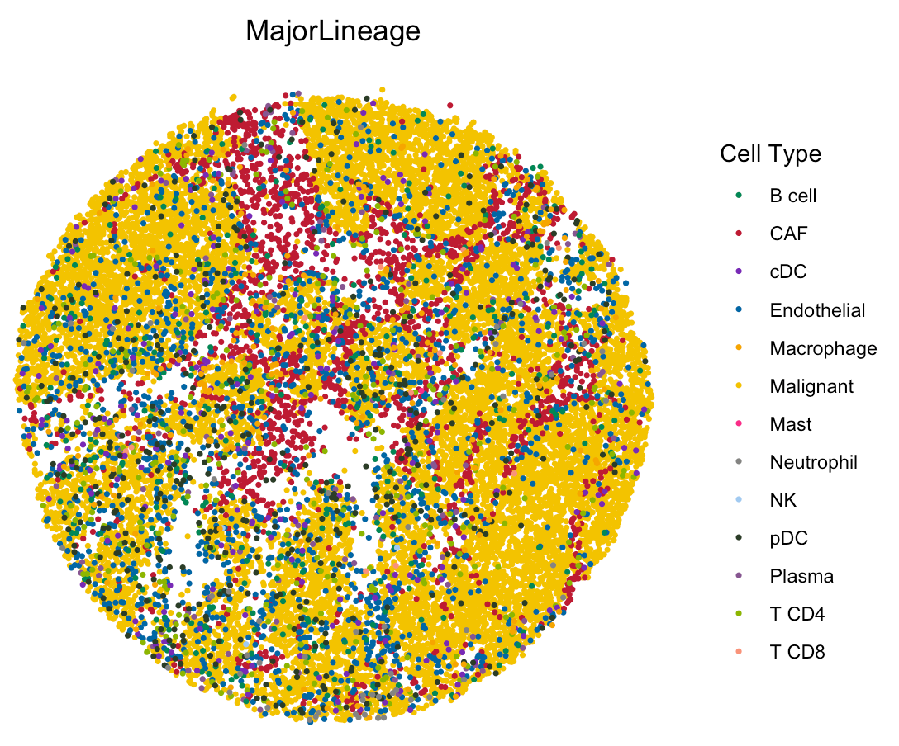

---
output: github_document
---


```{r, include = FALSE}
knitr::opts_chunk$set(
  collapse = TRUE,
  comment = "#>"
)
```

This tutorial demonstrates how to apply SpaCET to a colorectal cancer Slide-seq dataset from [Zhao et al, 2021](https://www.nature.com/articles/s41586-021-04217-4){target="_blank"}. Each bead is 10 µm in diameter covering 1-2 cells. Before running the tutorial, make sure that the SpaCET package and its dependencies have been installed.

## Create SpaCET object

User need `create.SpaCET.object` to create a SpaCET object by preparing four types of input data referring to a tumor ST sample.

1) spatial transcriptomics count data. The spatial transcriptomics count data must be in the format of matrix with gene name (row) x spot ID (column).
2) spatial location information. The spot coordinates should be in the format of matrix with spot ID (row) x coordinates (column). This 1st and 2nd columns represent X and Y coordinates, respectively.
3) path to the H&E image file. The image path can be NA if unavailable.
4) platform.

``` r
library(SpaCET)

hiresST_Path <- system.file("extdata", 'hiresST_CRC', package = 'SpaCET')

# load count matrix
load(paste0(hiresST_Path,"/counts.rda"))

# show count matrix
counts[1:6,1:3]

## 6 x 3 sparse Matrix of class "dgCMatrix"
##         2364.115x3072.225 3484.52x1734.005 2279.745x2951.975
## A1BG                    .                .                 .
## A1CF                    .                1                 2
## A2M                     .                .                 .
## A2ML1                   .                .                 .
## A3GALT2                 .                .                 .
## A4GALT                  .                .                 .

# load count matrix
load(paste0(hiresST_Path,"/spotCoordinates.rda"))

# show count matrix
head(spotCoordinates)

##                          X        Y
## 2364.115x3072.225 2364.115 3072.225
## 3484.52x1734.005  3484.520 1734.005
## 2279.745x2951.975 2279.745 2951.975
## 3061.825x1556.49  3061.825 1556.490
## 2274.22x2982.525  2274.220 2982.525
## 2986.945x1603.68  2986.945 1603.680

# create a SpaCET object.
SpaCET_obj <- create.SpaCET.object(
  counts=counts,
  spotCoordinates=spotCoordinates,
  imagePath=NA,
  platform = "SlideSeq"
)

# show this object.
str(SpaCET_obj)

```

## Deconvolve ST data

We use the in-house reference to deconvolve this ST sample.

``` r
# deconvolve ST data; ~30 minutes
SpaCET_obj <- SpaCET.deconvolution(SpaCET_obj, cancerType="CRC", coreNo=6)
# Since Windows does not support parallel computation, please set coreNo=1 for Windows OS.

# show the ST deconvolution results
SpaCET_obj@results$deconvolution$propMat[1:13,1:3]

##             2364.115x3072.225 3484.52x1734.005 2279.745x2951.975
## Malignant                   1                1                 1
## CAF                         0                0                 0
## Endothelial                 0                0                 0
## Plasma                      0                0                 0
## B cell                      0                0                 0
## T CD4                       0                0                 0
## T CD8                       0                0                 0
## NK                          0                0                 0
## cDC                         0                0                 0
## pDC                         0                0                 0
## Macrophage                  0                0                 0
## Mast                        0                0                 0
## Neutrophil                  0                0                 0
```

## Visualize the cell type proportion

We provide `SpaCET.visualize.spatialFeature` to present the spatial distribution of cell types. `spatialFeatures` could be a vector of cell types. If user would like to visualize multiple cell types in a single panel, you can assign a list to `spatialFeatures`. For example, combine CAF and endothelial cell types into stromal cell.

``` r
# show the spatial distribution of malignant cells and macrophages.
SpaCET.visualize.spatialFeature(
  SpaCET_obj, 
  spatialType = "CellFraction", 
  spatialFeatures = list(Malignant=c("Malignant"),Stromal=c("CAF","Endothelial")),
  sameScaleForFraction = TRUE,
  pointSize = 0.6
)
```


User can check the most abundant cell type in each bead by setting `spatialType` as "MostAbundantCellType". `spatialFeatures` could be "MajorLineage" or "SubLineage".

``` r
# load the color for cell types
load(paste0(hiresST_Path,"/colors_vector.rda"))

# show colors
head(colors_vector,3)

## Malignant            CAF    Endothelial
## "#f3c300"      "#be0032"      "#0067a5"

# show the spatial distribution of all cell types.
SpaCET.visualize.spatialFeature(
  SpaCET_obj, 
  spatialType = "MostAbundantCellType", 
  spatialFeatures = "MajorLineage", 
  colors = colors_vector,
  pointSize = 0.6
)
```


