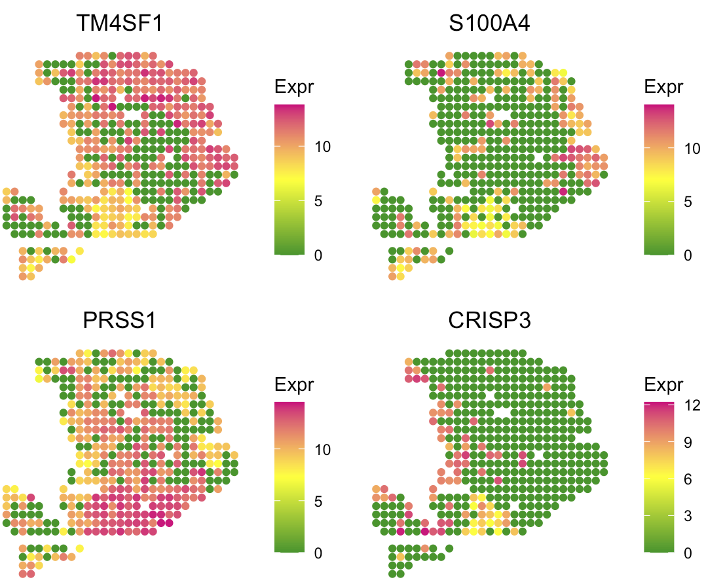

---
output: github_document
---


```{r, include = FALSE}
knitr::opts_chunk$set(
  collapse = TRUE,
  comment = "#>"
)
```

Since most tumor spatial transcriptomics (ST) data do not have matched scRNA-seq data from the same sample, SpaCET does not require malignant, stromal and immune cell reference. However, SpaCET can still accept a customized reference to carry out cell type deconvolution. This tutorial demonstrates how to run SpaCET with a matched scRNA-seq dataset by using a pancreatic ductal adenocarcinoma (PDAC) ST data set from [Moncada et al, 2020](https://www.nature.com/articles/s41587-019-0392-8){target="_blank"}. Each spot is 100 µm in diameter.

## Create SpaCET object
To read your ST data into R, user can create a SpaCET object by using `create.SpaCET.object` or `create.SpaCET.object.10X`. Specifically, if users are analyzing an ST dataset from 10x Visium, they only need to input "visiumPath" by using `create.SpaCET.object.10X`. Please make sure that "visiumPath" points to the standard output folders of 10x SpaCET Ranger, which has both "filtered_feature_bc_matrix" and "spatial" folders.

Here, since the PDAC ST data set was generated from the original ST technology, user need `create.SpaCET.object` to create a SpaCET object by preparing four types of input data referring to a tumor ST sample. 

1) spatial transcriptomics count data. The spatial transcriptomics count data must be in the format of matrix with gene name (row) x spot ID (column).
2) spatial location information. The spot coordinates should be in the format of matrix with spot ID (row) x coordinates (column). This 1st and 2nd columns represent X and Y coordinates, respectively.
3) path to the H&E image file. The image path can be NA if unavailable.
4) platform.

``` r
library(SpaCET)

oldST_Path <- system.file("extdata", 'oldST_PDAC', package = 'SpaCET')
load(paste0(oldST_Path,"/st_PDAC.rda"))

# show count matrix
counts[1:6,1:5]

##        10x10 10x13 10x14 10x15 10x16
## A1CF       0     0     0     0     0
## A2M       13     0     4     0     0
## A4GALT     1     0     0     0     0
## A4GNT      0     0     1     0     0
## AAAS       0     0     0     0     0
## AACS       0     0     0     0     0

# show coordinate matrix
spotCoordinates[1:5,]

##        X  Y
## 10x10 10 10
## 10x13 10 13
## 10x14 10 14
## 10x15 10 15
## 10x16 10 16

# load ST data to create a SpaCET object.
SpaCET_obj <- create.SpaCET.object(
  counts=counts,
  spotCoordinates=spotCoordinates,
  imagePath=NA,
  platform = "oldST"
)

# show this object.
str(SpaCET_obj)

```

## Deconvolve cell lineage
We provide `SpaCET.deconvolution.matched.scRNAseq` to deconvolve a SpaCET object with a customized scRNA-seq data. User need to prepare three types of input data referring to the matched scRNA-seq dataset.

1) single cell RNA-seq (scRNA-seq) count data. The scRNA-seq count data must be in the format of matrix with gene name (row) x cell ID (column).
2) cell annotation information. This matrix should include two columns, i,e., cellID and cellType. Each row represents a single cell. The name of row should be same as the column cellID.
3) Hierarchical tree of cell types. This should be organized by using a list, and the name of each element are major lineages while the value of elements are the corresponding sublineages. If a major lineage does not have any sublineages, the value of this major lineage should be itself.

``` r
# load sc data
oldST_Path <- system.file("extdata", 'oldST_PDAC', package = 'SpaCET')
load(paste0(oldST_Path,"/sc_PDAC.rda"))

# show count matrix
sc_counts[1:6,1:5]

##         c1 c2 c3 c4 c5
## A1BG     0  0  0  0  0
## A1CF     0  0  0  1  0
## A2M      0  0  0  0  0
## A2ML1    0  0  0  0  0
## A3GALT2  0  0  0  0  0
## A4GALT   0  0  0  0  0

# show cell annotation matrix
sc_annotation[1:6,]

##    cellID bio_celltype                            
## c1 "c1"   "Acinar cells"                          
## c2 "c2"   "Ductal - terminal ductal like"         
## c3 "c3"   "Ductal - terminal ductal like"         
## c4 "c4"   "Ductal - CRISP3 high/centroacinar like"
## c5 "c5"   "Cancer clone A"                        
## c6 "c6"   "Cancer clone A" 

# show cell type lineage tree
head(sc_lineageTree)

## $Cancer
## [1] "Cancer clone A" "Cancer clone B"
## 
## $Ductal
## [1] "Ductal - APOL1 high/hypoxic"   "Ductal - CRISP3 high/centroacinar like"
## [3] "Ductal - MHC Class II"         "Ductal - terminal ductal like"         
## 
## $Macrophage
## [1] "Macrophages A" "Macrophages B"
## 
## $mDC
## [1] "mDCs A" "mDCs B"
## 
## $`Acinar cells`
## [1] "Acinar cells"
## 
## $`Endocrine cells`
## [1] "Endocrine cells"
```

Then, user can run `SpaCET.deconvolution.matched.scRNAseq` to carry out cell type deconvolution.

``` r
# deconvolve ST data; ~2 minutes
SpaCET_obj <- SpaCET.deconvolution.matched.scRNAseq(
  SpaCET_obj, 
  sc_counts=sc_counts, 
  sc_annotation=sc_annotation, 
  sc_lineageTree=sc_lineageTree, 
  coreNo=6
)
# Since Windows does not support parallel computation, 
# please set coreNo=1 for Windows OS.
``` 

## Visualize the cell type proportion

We provide `SpaCET.visualize.spatialFeature` to present the spatial distribution of cell types.

``` r
# show the spatial distribution of all cell types.
SpaCET.visualize.spatialFeature(
  SpaCET_obj, 
  spatialType = "CellFraction", 
  spatialFeatures="All", 
  sameScaleForFraction = TRUE,
  pointSize = 1.5, 
  nrow=4
)
```


To show cell type composition in pie chart, user can set `spatialType = "CellTypeComposition"`. 

``` r
# load the color for cell types
load(paste0(oldST_Path,"/colors_vector.rda"))

# draw scatter pie
SpaCET.visualize.spatialFeature(
     SpaCET_obj, 
     spatialType = "CellTypeComposition", 
     spatialFeatures = "MajorLineage", 
     colors = colors_vector,
     pointSize = 0.5
 )
```


``` r
SpaCET.visualize.spatialFeature(
  SpaCET_obj, 
  spatialType = "CellFraction",
  spatialFeatures = c(
    "Cancer clone A",
    "Cancer clone B",
    "Acinar cells",
    "Ductal - CRISP3 high/centroacinar like"),
  nrow=2
)
``` 


User can use the following code to visualize the marker gene expression level and verify the cell type deconvolution.

``` r
# Markers for cancer clone A and B, acinar cell, and centroacinar like ductal cell
SpaCET.visualize.spatialFeature(
  SpaCET_obj,
  spatialType = "GeneExpression",
  spatialFeatures = c("TM4SF1","S100A4","PRSS1","CRISP3"),
  nrow=2
)
``` 




## Extand this function module
Although our tutorials focus on analyzing ST data from tumor samples, in principle, SpaCET can be applied to any ST datasets with matched scRNA-seq data.
