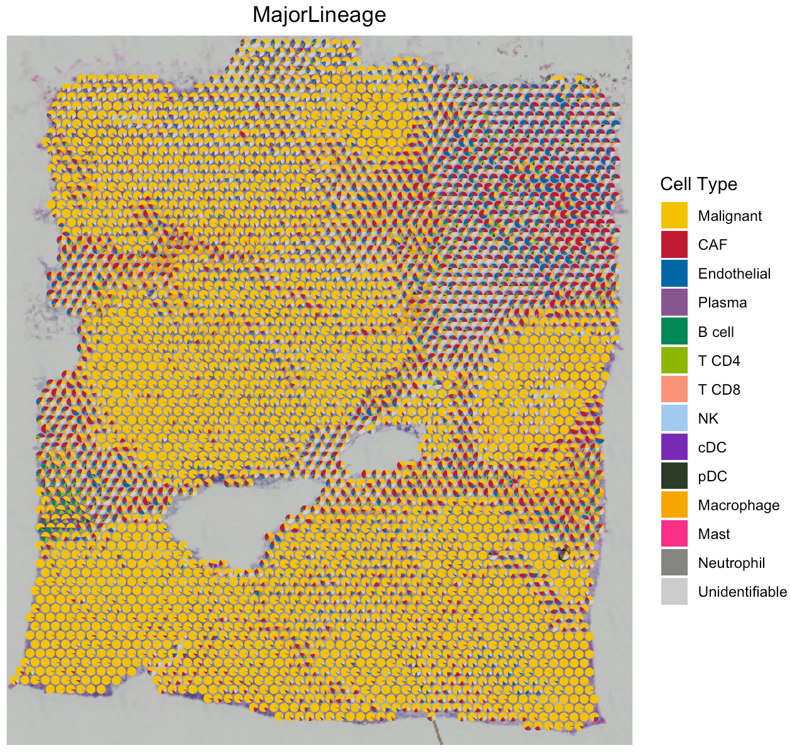

---
output: github_document
---


```{r, include = FALSE}
knitr::opts_chunk$set(
  collapse = TRUE,
  comment = "#>"
)
```

This tutorial demonstrates how to run SpaCET to estimate cell identities and cell-cell interactions by using a breast cancer spatial transcriptomics (ST) data set from [10x/Visium](https://www.10xgenomics.com/resources/datasets/human-breast-cancer-block-a-section-1-1-standard-1-0-0){target="_blank"}. Each spot is 55 µm in diameter covering [1-10 cells](https://kb.10xgenomics.com/hc/en-us/articles/360035487952-How-many-cells-are-captured-in-a-single-spot){target="_blank"}. Before running the tutorial, make sure that the SpaCET package and its dependencies have been installed.

## Create SpaCET object

To read your ST data into R, user can create an SpaCET object by using `create.SpaCET.object` or `create.SpaCET.object.10X`. Specifically, if users are analyzing an ST dataset from 10x Visium, they only need to input "visiumPath" by using `create.SpaCET.object.10X`. Please make sure that "visiumPath" points to the standard output folders of 10x Space Ranger, which includes both (1) sequencing data, i.e., "filtered_feature_bc_matrix.h5" file or "filtered_feature_bc_matrix" folder, and (2) image folder "spatial". For <span style="color:red">Visium HD</span> data, you can set `visiumPath <- "/Your/data/path/to/binned_outputs/square_016um/"`.

Here, we create an SpaCET object for the current breast cancer visium sample. 

``` r
library(SpaCET)

# set the path to the in-house breast cancer ST data. User can set the paths to their own data.
visiumPath <- file.path(system.file(package = "SpaCET"), "extdata/Visium_BC")

# load ST data to create an SpaCET object.
SpaCET_obj <- create.SpaCET.object.10X(visiumPath = visiumPath)

# show this object.
str(SpaCET_obj)
```

The UMI count matrix is stored in `SpaCET_obj@input$counts` as a sparse matrix. Each row represents a gene whereas each column is a spot.

``` r
# show this object.
SpaCET_obj@input$counts[1:8,1:6]
## 8 x 6 sparse Matrix of class "dgCMatrix"
##             50x102 59x19 14x94 47x13 73x43 61x97
## MIR1302-2HG      .     .     .     .     .     .
## FAM138A          .     .     .     .     .     .
## OR4F5            .     .     .     .     .     .
## AL627309.1       .     .     .     .     .     1
## AL627309.3       .     .     .     .     .     .
## AL627309.2       .     .     .     .     .     .
## AL627309.4       .     .     .     .     .     .
## AL732372.1       .     .     .     .     .     .
```

## Show quality control metrics

After creating the SpaCET object, you can use `SpaCET.visualize.spatialFeature` to show both UMI and gene counts across all ST spots, respectively. Specifically, the "UMI" option presents the overall UMI counts within a spot while the "Gene" option represents the number of expressed genes (i.e., genes with at least one UMI count) in a particular spot.

``` r
# filter out spots with less than 100 expressed genes
SpaCET_obj <- SpaCET.quality.control(SpaCET_obj, min.genes=100)

# plot the QC metrics
SpaCET.visualize.spatialFeature(
  SpaCET_obj, 
  spatialType = "QualityControl", 
  spatialFeatures=c("UMI","Gene"),
  imageBg = TRUE
)

```


## Deconvolve ST data

By two stages, `SpaCET.deconvolution` would deconvolve all mixtures of ST spots into malignant, immune, and stromal cells. SpaCET first estimates malignant cell fraction by a gene pattern dictionary of copy number alterations (CNA) and expression changes in common malignancies. Subsequently, based on an in-house hierarchical cell lineage derived from single-cell RNA-seq data sets from diverse cancer types, a constrained regression model is used to determine immune and stromal cell fraction, and also include an unidentifiable component to calibrate cellular density variations across tissue regions.

Specifically, user need to specify the cancer type of this tumor ST data set by using `cancerType` parameter, which is utilized to select cancer type-specific CNA or expression signature to infer malignant cell fraction. The code of cancer types can be found in the following dropdown content. When correlating expression profiles of ST spots to the cancer type-specific signature, we set the cancer type-specific CNA signature as the first option because chromosomal instability is widely considered one consistent feature of human tumors. Alternatively, if no spots strongly correlate with the CNA signature, the cancer type-specific expression signature would be activated. This situation might result from chromosomally stable cancer cells with low CNA. For cancer types not included in our dictionary, we created a pan-cancer expression signature by averaging all cancer type-specific expression signatures.  

<details>
  <summary>**How many caner types are in the gene pattern dictionary?**</summary>
  
  SpaCET includes a gene pattern dictionary of copy number alterations (CNA) and expression changes for 30 solid tumor types. The cancer type-specific CNA signature of a cancer type was computed by averaging bulk tumor CNA values on gene levels across patients. For each cancer type, the lower quartile of patients sorted by total CNA burdens was excluded before calculating the CNA signature. The cancer type-specific expression signature of a cancer type was generated as log2 Fold Change of differential expression between tumor and normal samples. Several cancer types do not have expression signatures due to a lack of adequate normal samples (n < 10 patients). The pan-cancer expression signature was created by averaging all cancer type-specific expression signatures.
  
  
  
</details>

``` r
# deconvolve ST data
SpaCET_obj <- SpaCET.deconvolution(SpaCET_obj, cancerType="BRCA", coreNo=8)
# Since Windows does not support parallel computation, please set coreNo=1 for Windows OS.

# show the ST deconvolution results
SpaCET_obj@results$deconvolution$propMat[1:13,1:6]

##                   50x102 59x19        14x94        47x13        73x43
## Malignant   2.860636e-01     1 6.845966e-02 3.899756e-01 9.608802e-01
## CAF         3.118545e-01     0 3.397067e-01 1.111980e-01 3.372692e-02
## Endothelial 5.510895e-02     0 1.427060e-01 3.080531e-02 5.263544e-03
## Plasma      2.213392e-02     0 1.507382e-02 1.183170e-02 9.071809e-06
## B cell      3.885793e-03     0 9.271616e-02 1.406470e-01 1.329085e-06
## T CD4       1.344389e-01     0 1.554305e-02 1.249414e-01 1.112392e-05
## T CD8       7.578696e-03     0 2.514558e-07 1.379856e-03 1.123043e-06
## NK          7.104005e-04     0 1.670019e-06 4.890387e-08 3.562557e-07
## cDC         1.421632e-07     0 8.278023e-02 7.584295e-02 2.851146e-07
## pDC         1.606443e-06     0 2.283754e-02 1.805671e-02 3.878344e-07
## Macrophage  1.703304e-01     0 5.021248e-02 9.531511e-02 9.253645e-07
## Mast        7.905067e-08     0 1.621498e-05 1.333430e-07 1.162099e-07
## Neutrophil  1.380073e-05     0 9.528996e-07 1.167503e-08 9.908635e-05
```

Of note, the value from deconvolution results represents the fraction of cell types. User may find that the fraction sum of all cell types in a spot (column) is beyond 1. This is because SpaCET outputs the cell fractions for both major lineages and their corresponding sublineages, e.g., T CD4 as well as Th1, Th2... .

## Visualize the cell type proportion

We provide `SpaCET.visualize.spatialFeature` to present the spatial distribution of cell types.

``` r
# show the spatial distribution of malignant cells and macrophages.
SpaCET.visualize.spatialFeature(
  SpaCET_obj, 
  spatialType = "CellFraction", 
  spatialFeatures=c("Malignant","Macrophage")
)
```


``` r
# show the spatial distribution of all cell types.
SpaCET.visualize.spatialFeature(
  SpaCET_obj, 
  spatialType = "CellFraction", 
  spatialFeatures="All", 
  sameScaleForFraction = TRUE,
  pointSize = 0.1, 
  nrow=5
)
```


Since some cell types have relatively low abundance, user can get a better vision by setting `sameScaleForFraction = FALSE`. In addition, you can open up an interactive visualization panel by setting `interactive=TRUE` to browse the deconvolution results.

``` r
SpaCET.visualize.spatialFeature(SpaCET_obj,interactive=TRUE)
```


## Estimate cell-cell interactions
After decomposing cell fractions, SpaCET can infer intercellular interactions based on cell colocalization and ligand-receptor coexpression. Linear correlations of cell fraction between cell types are computed across all ST spots to evaluate cell-type colocalization. High positive correlations indicate that cell-type pairs tend to colocalize together. To infer physical interactions, SpaCET tests the co-expression of ligand and receptor genes within the same ST spot for the co-localized cell-type pairs.

### Find co-localized cell-type pairs

SpaCET provides `SpaCET.CCI.colocalization` and `SpaCET.visualize.colocalization` to compute and visualize the co-localized cell-type pairs.

``` r
# calculate the cell-cell colocalization.
SpaCET_obj <- SpaCET.CCI.colocalization(SpaCET_obj)

# visualize the cell-cell colocalization.
SpaCET.visualize.colocalization(SpaCET_obj)
```


In this breast tumor tissue, we identified several potential colocalized cell-type pairs (see red dots in the left panel), such as CAFs with endothelial cells and M2 macrophages. To rule out a high cell fraction correlation caused by similar reference profiles, we compared the correlations between cell-type fractions and between cell-type reference profiles (see the right panel). Although the correlation of CAF and endothelial cell fractions is high, their profile similarity is also proportionally high. However, the similarity between CAF and M2 macrophage references was extremely low, indicating that the CAF-M2 colocalization is not simply due to profile similarity.

### Analyze the L-R network enrichment within ST spots

Cell colocalization does not directly indicate physical interaction. Thus, we sought further evidence for cell-cell interactions by analyzing ligand-receptor (L-R) interactions within ST spots. From a previous [study](https://www.nature.com/articles/ncomms8866){target="_blank"}, we collected approximately 2,500 L-R pairs as an in-house L-R network. For each ST data set, SpaCET shuffled the L-R interaction network by using [BiRewire](https://bioconductor.org/packages/release/bioc/html/BiRewire.html){target="_blank"} package to generate 1,000 randomized networks while preserving directed degree distributions. For a spot, an L-R network score is defined as the sum of expression products between all L-R pairs, divided by the average random value from 1,000 randomized networks. 

``` r
# calculate the L-R network score across ST spots.
SpaCET_obj <- SpaCET.CCI.LRNetworkScore(SpaCET_obj,coreNo=8)

# visualize the L-R network score.
SpaCET.visualize.spatialFeature(
  SpaCET_obj, 
  spatialType = "LRNetworkScore", 
  spatialFeatures=c("Network_Score","Network_Score_pv")
)

```


The L-R network score at each ST spot indicates the overall intensities of ligand-receptor interactions at each location, but not the specific interactions between two cell types. Thus, SpaCET further performed an enrichment analysis of L-R network scores for each cell-type pair. For example, for the colocalization between CAF and M2 cells in the breast tumor tissue, SpaCET grouped all ST spots into four categories: CAF-M2 colocalized, CAF or M2 dominated, and others (see the left and middle panels in the following figure). We found that CAF-M2 colocalized spots have more substantial L-R interaction network scores than CAF/M2-dominated spots (right panel).

``` r
# Ligand-Receptor analysis for a co-localized cell-type pair
SpaCET_obj <- SpaCET.CCI.cellTypePair(SpaCET_obj, cellTypePair=c("CAF","Macrophage M2"))
## [1] "CAF and Macrophage M2 have potential intercellular interaction in the current tissue."

# Visualize the interaction analysis of a co-localized cell-type pair.
SpaCET.visualize.cellTypePair(SpaCET_obj, cellTypePair=c("CAF","Macrophage M2"))

``` 


## Analyze the tumor-immune interface
 Interestingly, besides the interaction significance, we found an enrichment of CAF-M2 interactions close to boundaries between tumor and immune/stromal regions. The distance between CAF-M2 and the tumor-immune border was calculated by averaging the distances between each CAF-M2 interaction spot and its nearest tumor border spot. We randomly selected the same number of spots as CAF-M2 spots from the non-malignant regions and calculated their distances to the border as the null distribution. The result showed that CAF-M2 interaction spots are significantly closer to the tumor-immune boundaries.

``` r
# Identify the Tumor-Stroma Interface
SpaCET_obj <- SpaCET.identify.interface(SpaCET_obj)

# Visualize the Interface
SpaCET.visualize.spatialFeature(SpaCET_obj, spatialType = "Interface", spatialFeature = "Interface")

```


``` r
# Combine the interface and interaction spots
SpaCET_obj <- SpaCET.combine.interface(SpaCET_obj, cellTypePair=c("CAF","Macrophage M2"))

# Visualize the Interface. The spatialFeature should be formated as "Interface&celltype1_celltype2". Celltype 1 and 2 is in the order of alphabet.
SpaCET.visualize.spatialFeature(SpaCET_obj, spatialType = "Interface", spatialFeature = "Interface&CAF_Macrophage M2")

```


``` r
# Compute the distance of CAF-M2 to tumor border
SpaCET.distance.to.interface(SpaCET_obj, cellTypePair=c("CAF", "Macrophage M2"))

``` 


## Explore cancer cell states
The gene expression profiles of tumor cells (i.e., cancer cell states) are determined by both tumor cells’ genetic background and cell-cell interactions from the surrounding environment. As an explorative extension, SpaCET can automatically explore the spatial distribution of different cancer cell states.

Based on the deconvolution results of the breast cancer dataset, we selected the ST spots with high fractions (> 0.7) of malignant cells as tumor spots. Then, SpaCET hierarchically clustered these malignant spots to infer different states. The Silhouette value, measuring the similarity among the ST spots within each cluster compared to other clusters, was used to select the optimal cluster number. In this way, the reference profile of different cancer cell states can be computed by averaging the expression profile of all spots in a cluster, i.e., a cancer cell state.

Similar to the deconvolution of immune major lineages into sublineages, the overall malignant cell fraction would be decomposed to multiple cancer cell states. Thus, the sum fraction of cancer cell states equals to the malignant cell fraction for each spot.

``` r
# further deconvolve malignant cell states
SpaCET_obj <- SpaCET.deconvolution.malignant(SpaCET_obj, coreNo = 8)

# show cancer cell state fraction of the first five spots
SpaCET_obj@results$deconvolution$propMat[c("Malignant cell state A","Malignant cell state B"),1:6]

##                           50x102        59x19        14x94     47x13        73x43     61x97
## Malignant cell state A 0.2295498 9.999900e-01 6.845962e-02 0.2038680 9.608802e-01 0.6517794
## Malignant cell state B 0.0565137 1.239573e-11 3.921715e-08 0.1861075 2.340661e-09 0.2675332

SpaCET.visualize.spatialFeature(
  SpaCET_obj, 
  spatialType = "CellFraction", 
  spatialFeatures=c("Malignant","Malignant cell state A","Malignant cell state B"), 
  nrow=1
)

```


In order to annotate the identified Cancer Cell States, you can follow this [tutorial](https://data2intelligence.github.io/SpaCET/articles/GeneSetScore.html#calculate-cancer-cell-state-score) to calculate the known cancer cell state score across spots, and then compare them.
