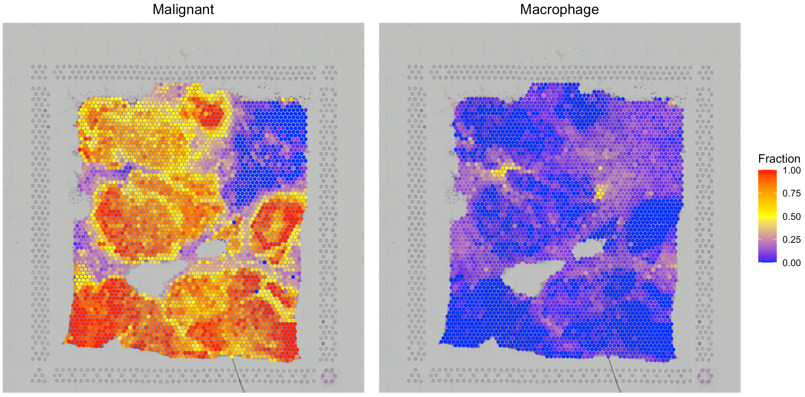

---
output: github_document
---


```{r, include = FALSE}
knitr::opts_chunk$set(
  collapse = TRUE,
  comment = "#>"
)
```

This tutorial demonstrates how to run SpaCE to estimate cell identities and cell-cell interactions by using a breast cancer spatial transcriptomics (ST) data set from [10x Visium](https://www.10xgenomics.com/resources/datasets/human-breast-cancer-block-a-section-1-1-standard-1-0-0){target="_blank"}. Before running the tutorial, make sure that the SpaCE package and its dependencies have been installed.

## Create SpaCE object

To read your ST data into R, user can create an SpaCE object by using `create.SpaCE.object`. Specifically, if user are analyzing a Visium dataset, they only need to input "visiumPath". Please make sure that "visiumPath" points to the standard output folders of 10x Visium, which has both "filtered_feature_bc_matrix" and "spatial" folders.

The "filtered_feature_bc_matrix"`" folder includes\
"barcodes.tsv.gz": spot level barcodes\
"features.tsv.gz": list of genes\
"matrix.mtx.gz": (sparse) matrix of counts

The "spatial" folder includes\
“tissue_positions_list.csv” : barcodes and spatial information\
“tissue_lowres_image.png” : hematoxylin and eosin (H&E) image\
“scalefactors_json.json” : scaling factors for adjusting the coordinates 

Here, we create an SpaCE object for this breast cancer visium dataset.

``` r
library(SpaCE)

# set the path to the in-house breast cancer ST data. User can set the paths to their own data.
visiumPath <- system.file("extdata", 'Visium_BC', package = 'SpaCE')

# load ST data to create an SpaCE object.
SpaCE_obj <- create.SpaCE.object(visiumPath = visiumPath)

# show this object.
str(SpaCE_obj)

```

## Show key quality control metrics

After creating the SpaCE object, user can use `SpaCE.visualize.metrics` to show both UMI and gene counts across all ST spots, respectively. 

``` r
# plot the QC metrics.
library(patchwork)
p1 <- SpaCE.visualize.metrics(SpaCE_obj, itemQC="UMI")
p2 <- SpaCE.visualize.metrics(SpaCE_obj, itemQC="Gene")
p1 | p2
```


## Deconvolve ST data

By two stages, `SpaCE.deconvolution` would deconvolve all mixtures of ST spots into malignant, immune, and stromal cells. SpaCE first estimates malignant cell faction by a gene pattern dictionary of copy number alterations (CNA) and expression changes in common malignancies. Subsequently, based on an in-house hierarchical cell lineage derived from single-cell RNA-seq data sets from diverse cancer types, a constrained regression model is used to determine immune and stromal cell fraction, and also include an unidentifiable component to calibrate cellular density variations across tissue regions.

Specifically, user need to specify the cancer type of this tumor ST data set by using `cancerType` parameter, which is utilized to select cancer type-specific CNA or expression signature to infer malignant cell fraction. The code of cancer types can be found in the following dropdown content. When correlating expression profiles of ST spots to the cancer type-specific signature, we set the cancer type-specific CNA signature as the first option because chromosomal instability is widely considered one consistent feature of human tumors. Alternatively, if no spots strongly correlate with the CNA signature, the cancer type-specific expression signature would be activated. This situation might result from chromosomally stable cancer cells with low CNA. For cancer types not included in our dictionary, we created a pan-cancer expression signature by averaging all cancer type-specific expression signatures.  

<details>
  <summary>**How many caner types are in the gene pattern dictionary?**</summary>
  
  SpaCE includes a gene pattern dictionary of copy number alterations (CNA) and expression changes for 30 solid tumor types. The cancer type-specific CNA signature of a cancer type was computed by averaging bulk tumor CNA values on gene levels across patients. For each cancer type, the lower quartile of patients sorted by total CNA burdens was excluded before calculating the CNA signature. The cancer type-specific expression signature of a cancer type was generated as log2 Fold Change of differential expression between tumor and normal samples. Several cancer types do not have expression signatures due to a lack of adequate normal samples (n < 10 patients). The pan-cancer expression signature was created by averaging all cancer type-specific expression signatures.
  
  
  
</details>

``` r
# deconvolve ST data
SpaCE_obj <- SpaCE.deconvolution(SpaCE_obj, cancerType="BRCA", coreNo=8)

# show the ST deconvolution results
SpaCE_obj@results$deconvolution[1:13,1:5]

##                   50x102 59x19        14x94        47x13        73x43
## Malignant   2.860636e-01     1 6.845966e-02 3.899756e-01 9.608802e-01
## CAF         3.118545e-01     0 3.397067e-01 1.111980e-01 3.372692e-02
## Endothelial 5.510895e-02     0 1.427060e-01 3.080531e-02 5.263544e-03
## Plasma      2.213392e-02     0 1.507382e-02 1.183170e-02 9.071809e-06
## B cell      3.885793e-03     0 9.271616e-02 1.406470e-01 1.329085e-06
## T CD4       1.344389e-01     0 1.554305e-02 1.249414e-01 1.112392e-05
## T CD8       7.578696e-03     0 2.514558e-07 1.379856e-03 1.123043e-06
## NK          7.104005e-04     0 1.670019e-06 4.890387e-08 3.562557e-07
## cDC         1.421632e-07     0 8.278023e-02 7.584295e-02 2.851146e-07
## pDC         1.606443e-06     0 2.283754e-02 1.805671e-02 3.878344e-07
## Macrophage  1.703304e-01     0 5.021248e-02 9.531511e-02 9.253645e-07
## Mast        7.905067e-08     0 1.621498e-05 1.333430e-07 1.162099e-07
## Neutrophil  1.380073e-05     0 9.528996e-07 1.167503e-08 9.908635e-05
```

## Visualize the cell type proportion

We provide `SpaCE.visualize.deconvolution` to present the spatial distribution of cell types by setting the parameter `cellType`.

``` r
# show the spatial distribution of malignant cells and macrophages.
p1 <- SpaCE.visualize.deconvolution(SpaCE_obj, cellType="Malignant")
p2 <- SpaCE.visualize.deconvolution(SpaCE_obj, cellType="Macrophage")
p1 + p2
```


By setting the parameter `interactive` as `TRUE`, user will open up a Shiny plot to interactively visualize each cell type and adjust the size and alpha intensity of spots.

``` r
# show the spatial distribution of malignant cells and macrophages.
SpaCE.visualize.deconvolution(SpaCE_obj, cellType="Malignant", interactive=TRUE)
```


## Identify cell-cell interaction
After decomposing cell fractions, SpaCE can infer intercellular interactions based on cell colocalization and ligand-receptor coexpression. Linear correlations of cell fraction between cell types are computed across all ST spots to evaluate cell-type colocalization. High positive correlations indicate that cell-type pairs tend to colocalize together. To infer physical interactions, SpaCE tests the co-expression of ligand and receptor genes within the same ST spot for the co-localized cell-type pairs.

### Find the co-localized cell-type pairs

SpaCE provides `SpaCE.CCI.colocalization` and `SpaCE.visualize.colocalization` to compute and visualize the co-localized cell-type pairs.

``` r
# calculate the cell-cell colocalization.
SpaCE_obj <- SpaCE.CCI.colocalization(SpaCE_obj)

# visualize the cell-cell colocalization.
SpaCE.visualize.colocalization(SpaCE_obj)
```


In this breast tumor tissue, we identified several potential colocalized cell-type pairs (see red dots in the left panel), such as CAFs with endothelial cells and M2 macrophages. To rule out a high cell fraction correlation caused by similar reference profiles, we compared the correlations between cell-type fractions and between cell-type reference profiles (see the right panel). Although the correlation of CAF and endothelial cell fractions is high, their profile similarity is also proportionally high. However, the similarity between CAF and M2 macrophage references was extremely low, indicating that the CAF-M2 colocalization is not simply due to profile similarity.

### Analyze the L-R network enrichment within ST spots

Cell colocalization does not directly indicate physical interaction. Thus, we sought further evidence for cell-cell interactions by analyzing ligand-receptor (L-R) interactions within ST spots. From a previous [study](https://www.nature.com/articles/ncomms8866){target="_blank"}, we collected approximately 2,500 L-R pairs as an in-house L-R network. For each ST data set, SpaCE shuffled the L-R interaction network by using [BiRewire](https://bioconductor.org/packages/release/bioc/html/BiRewire.html){target="_blank"} package to generate 1,000 randomized networks while preserving directed degree distributions. For a spot, an L-R network score is defined as the sum of expression products between all L-R pairs, divided by the average random value from 1,000 randomized networks. 

``` r
# calculate the L-R network score across ST spots.
SpaCE_obj <- SpaCE.CCI.LRNetworkScore(SpaCE_obj,coreNo=8)

# visualize the cell-cell colocalization.
SpaCE.visualize.LRNetworkScore(SpaCE_obj)
```


The L-R network score at each ST spot indicates the overall intensities of ligand-receptor interactions at each location, but not the specific interactions between two cell types. Thus, SpaCE further performed an enrichment analysis of L-R network scores for each cell-type pair. For example, for the colocalization between CAF and M2 cells in the breast tumor tissue, SpaCE grouped all ST spots into four categories: CAF-M2 colocalized, CAF or M2 dominated, and others (see the left and middle panels in the following figure). We found that CAF-M2 colocalized spots have more substantial L-R interaction network scores than CAF/M2-dominated spots (right panel).

``` r
# calculate the L-R network score across ST spots.
SpaCE.CCI.cellTypePair(SpaCE_obj, cellTypePair=c("CAF","Macrophage M2"))
``` 


## Explore cancer cell states
The gene expression profiles of tumor cells (i.e., cancer cell states) are determined by both tumor cells’ genetic background and cell-cell interactions from the surrounding environment. As an explorative extension, SpaCE can automatically explore the spatial distribution of different cancer cell states.

Based on the deconvolution results of the breast cancer dataset, we selected the ST spots with high fractions (> 0.7) of malignant cells as tumor spots. Then, SpaCE hierarchically clustered these malignant spots to infer different states. The Silhouette value, measuring the similarity among the ST spots within each cluster compared to other clusters, was used to select the optimal cluster number. 

``` r
# further deconvolve malignant cell states
SpaCE_obj <- SpaCE.deconvolution.malignant(SpaCE_obj, malignantCutoff = 0.7, coreNo = 8)

# show cancer cell state fraction of the first five spots
SpaCE_obj@results$deconvolution[
  grepl("Cancer cell state",rownames(SpaCE_obj@results$deconvolution)),
  1:5]

##                         50x102        59x19        14x94     47x13        73x43
## Cancer cell state A 0.21735562 9.999900e-01 6.845963e-02 0.2135212 9.608802e-01
## Cancer cell state B 0.06870794 1.239573e-11 2.906452e-08 0.1764543 2.402767e-10

p1 <- SpaCE.visualize.deconvolution(SpaCE_obj, cellType="Malignant")
p2 <- SpaCE.visualize.deconvolution(SpaCE_obj, cellType="Cancer cell state A")
p3 <- SpaCE.visualize.deconvolution(SpaCE_obj, cellType="Cancer cell state B")
p1+p2+p3
``` 

